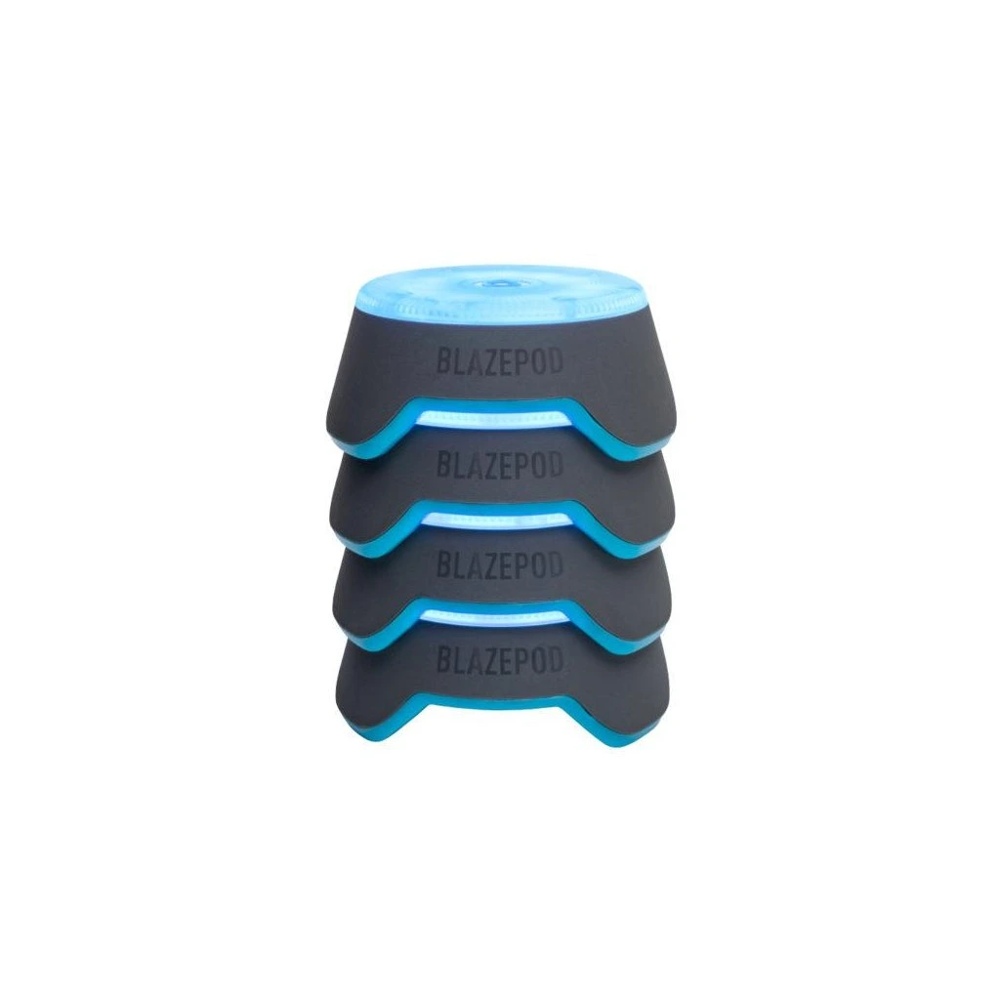
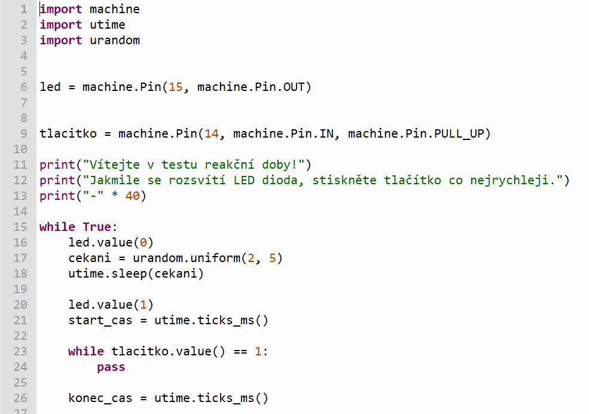
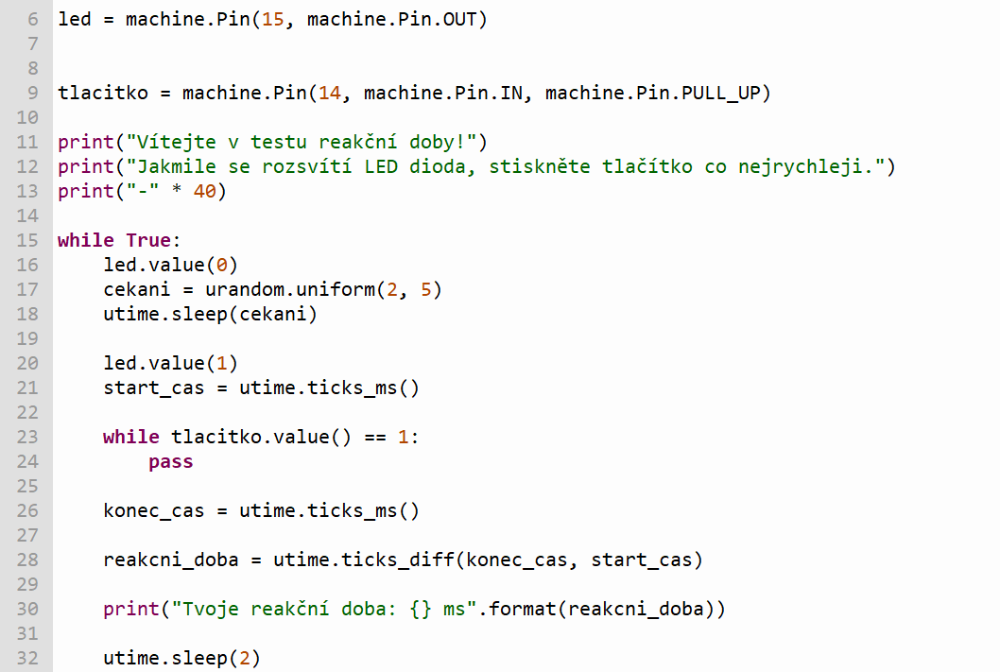

# Druhý ročníkový projekt
## Cíl projektu
Cílem projektu je vytvořit zařízení, které bude testovat naše reakce. Zařízení v náhodných intervalech rozsvítí LED diodu a úkolem je co nejrychleji stisknout tlačítko.
## Hardware
- Raspberry Pi Pico w 2
- Micro USB kabel
- Breadboard
- LED dioda
- Rezistor
- Tlačítko
- Propojovací dráty
## Software
- Thonny IDE
- CircuitPython
## Porovnání
### DIY
- Levnější
- Otevřený systém, možnost si cokoliv doprogramovat
- Připojení pomocí Wi-Fi
- Potřeba ho sám sestavit
### Komerční
- Dražší (+-5000,-)
- Uzavřený systém
- Připojení přes bluetooth
- Jednoduché pro běžné uživatele
 
 
### Shrnutí
DIY verze se vyplatí po finanční stránce, ale na komerční verzi je vidět, že je více robustní a vhodná pro mnoho typů tréninků, takže záleží na našich schopnostech a kreativitě a tom jak by sme chtěli tento reakční senzor využít. Pokud by to bylo na kvalitní trénink, tak by se vyplatilo samozřejmě komerční zařízení.
Pokud je někdo kutil a chce pouze nějaký zajimavý projekt a není to seriozní trenér tak se samozřejmě vyplatí si ho vytvořit sám doma.
## Postup práce
- Zapojíme Pico do breadboardu
- V Picu užmáme nahraný CircuitPython, takže nám to ulehčí práci
- Zapojíme LED diodu anodou přes rezistor a katodou na zem
- Poté připojíme tlačítko k jednomu pinu a poté na zem
- K vytvoření kódu jsem použil AI, jelikož nemám takové skušenosti s kódováním
 
 
